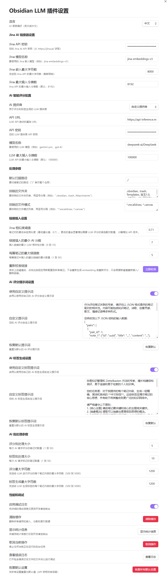

# Obsidian LLM 插件

[English](README.md) | [中文](README_CN.md)

一个功能强大、高度可配置的纯 TypeScript Obsidian 插件，使用 AI 服务自动分析笔记并插入智能链接推荐。


## 功能特性

- **AI 驱动的链接推荐**：使用 Jina 嵌入和大语言模型（Gemini、OpenAI 等）分析笔记之间的语义相似性并推荐相关链接
- **智能标签生成**：使用 AI 自动为笔记生成上下文标签
- **增量更新**：基于内容哈希的高效变更检测，确保只有修改过的笔记才会被重新处理
- **零外部依赖**：纯 TypeScript 实现，无运行时依赖
- **高度可配置**：提供 23+ 个可配置参数的综合设置面板
- **非阻塞 UI**：所有长时间运行的操作都在后台运行，并提供进度跟踪
- **智能缓存**：主索引 + 分片嵌入架构，实现最佳性能

## 安装

### 从发布版本安装

1. 从 [Releases](https://github.com/eacheat53/obsidian-llm-plugin/releases) 页面下载最新版本
2. 将文件解压到你的仓库的 `.obsidian/plugins/obsidian-llm-plugin/` 目录
3. 重新加载 Obsidian
4. 在设置 → 社区插件中启用该插件

### 从源代码安装

```bash
# 克隆仓库
git clone https://github.com/eacheat53/Obsidian-LLM-Plugin.git
cd obsidian-llm-plugin

# 安装依赖（使用 pnpm）
pnpm install

# 构建插件
pnpm run build

# 复制到你的仓库（文件在 dist/ 目录中）
cp dist/main.js dist/sql-wasm.wasm manifest.json styles.css /path/to/your/vault/.obsidian/plugins/obsidian-llm-plugin/
```

## 配置

### 必需的 API 密钥

1. **Jina AI API 密钥**：从 [Jina AI](https://jina.ai/) 获取 API 密钥
2. **LLM 提供商 API 密钥**：从以下选项中选择：
   - Google Gemini：从 [Google AI Studio](https://makersuite.google.com/app/apikey) 获取密钥
   - OpenAI：从 [OpenAI Platform](https://platform.openai.com/api-keys) 获取密钥

### 设置概览

打开设置 → Obsidian LLM Plugin 进行配置：

- **Jina AI 设置**：API 密钥、模型名称、最大字符数
- **AI 智能评分配置**：LLM 提供商选择和凭证
- **处理参数**：扫描路径、排除文件夹、文件模式
- **链接插入设置**：相似度阈值、分数限制、每个笔记的最大链接数
- **AI 评分提示设置**：自定义 AI 评分提示
- **AI 标签生成设置**：自定义标签生成提示
- **AI 批处理参数**：API 优化的批处理大小
- **性能和调试**：缓存管理、统计、调试日志

## 使用方法

### 快速访问菜单

点击左侧边栏的 Obsidian LLM Plugin 图标以访问：

1. **处理笔记并插入推荐链接**：运行完整工作流（扫描 → 嵌入 → 评分 → 插入链接）
2. **批量插入 AI 标签**：为选定的笔记或文件夹生成 AI 标签
3. **为当前笔记生成唯一 ID**：在活动笔记的前置元数据中添加唯一的 UUID

### 工作流程

1. **初始设置**：在笔记中添加哈希边界标记和 UUID
2. **处理笔记**：运行主工作流以生成嵌入并计算相似性
3. **查看链接**：检查在每个笔记的 `<!-- HASH_BOUNDARY -->` 后插入的推荐链接
4. **添加标签**（可选）：使用批量标签生成功能来组织你的仓库

### 文件结构

插件以结构化的方式修改你的笔记：

```markdown
---
note_id: 550e8400-e29b-41d4-a716-446655440000
tags: [ai-generated, knowledge-base]
---

你的主要内容在这里...

<!-- HASH_BOUNDARY -->
- [[相关笔记 1]]
- [[相关笔记 2]]


你在这里添加的其他内容会被保留...
```

## 工作原理

1. **扫描仓库**：插件扫描所有 markdown 文件（遵循排除模式）
2. **生成 UUID**：确保每个笔记在前置元数据中都有唯一标识符
3. **计算哈希**：对主要内容（`<!-- HASH_BOUNDARY -->` 之前）进行 SHA-256 哈希
4. **生成嵌入**：调用 Jina API 为已更改的笔记创建向量嵌入
5. **计算相似度**：计算所有笔记对之间的余弦相似度
6. **AI 评分**：LLM 评估相似笔记对的相关性（0-10 分）
7. **插入链接**：以 WikiLink 格式 `[[笔记标题]]` 插入得分最高的链接

## 性能

- 在标准硬件上处理 1000 个笔记时间少于 5 分钟
- 通过增量更新，处理时间减少 90% 以上
- 后台操作期间 UI 保持响应
- 高效的分片缓存架构支持 10,000+ 笔记的仓库

## 故障排除

### 链接未出现

- 检查 API 密钥是否正确配置
- 验证相似度阈值是否太高（尝试 0.7）
- 确保最低 AI 分数不太严格（尝试 5）
- 检查排除文件夹/模式是否过滤了你的笔记

### 高 API 成本

- 减少"Jina 嵌入最大字符数"（默认：8000）
- 提高"Jina 相似度阈值"以减少评分对数
- 使用批处理设置优化请求
- 使用哈希边界标记启用增量更新

### 性能问题

- 通过设置 → 性能和调试清除缓存
- 如果内存使用过高，减少批处理大小
- 向排除列表添加更多文件夹（例如附件、模板）

### 调试模式

在设置 → 性能和调试中启用调试日志，然后检查开发者控制台（Ctrl/Cmd+Shift+I）查看详细日志。

## 开发

参见 [quickstart.md](specs/002-ai-linker-plugin/quickstart.md) 了解开发设置和贡献指南。

## 架构

- **纯 TypeScript**：无外部运行时依赖
- **服务层**：模块化设计（api-service、ai-logic-service、cache-service 等）
- **分片缓存**：主索引（`index.json`）+ 每个笔记的嵌入
- **三层错误处理**：配置/瞬态/内容错误分类
- **异步/等待**：所有 I/O 操作都是非阻塞的

## 许可证

MIT
